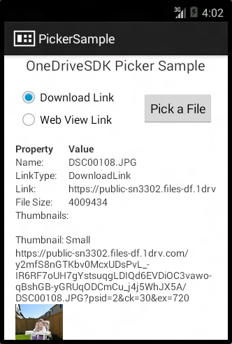

# Android picker sample app

## What it does

The OneDrive picker sample app provides a quick view of the data returned when a
file is picked. You can use this sample alongside the [guide](../README.md) to learn more
about how the picker SDK works, but beyond that it won’t do much for you.

## How to use it

### Get the SDK (contains sample app)
- [Download the zip](https://github.com/OneDrive/onedrive-picker-android/archive/master.zip) and extract the files

OR
- [Clone the repo](https://github.com/OneDrive/onedrive-picker-android.git): `git clone https://github.com/OneDrive/onedrive-picker-android.git`

### Setup

1. In Android Studio, select **Import Project...**.  In Eclipse, go to **File** → **Import** → **General** → **Existing Projects into Workspace**.
2. Click **Browse..** to select the *onedrive-picker-android*, where you saved the SDK, as your root directory. Make sure *OneDriveSDK* and *OneDriveSDK.PickerSample* are checked.
3. If not already installed, follow prompts or go to the *Android SDK Manager* to install Android 4.4.2 (API 19)

### Run the app
1. In Android Studio, **Run 'Picker Sample'**.  In Eclipse, right-click the *OneDriveSDK.PickerSample* project and select **Run As** → **Android Application**.

    > *Note the application will not be able to launch the OneDrive picker in the emulator.*

2. Select a link type and press "Pick a File" to launch the OneDrive picker. *The picker will provide a login screen, if you are not logged into the OneDrive app.*
3. Choose a file and see the friendly response in the sample app!
