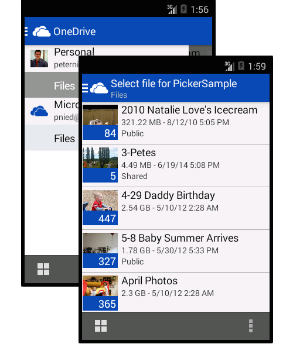

# OneDrive picker for Android

The open picker is the fastest way to get files from OneDrive and OneDrive for Business into your Android
app. It provides a set of Java APIs that your app can use to browse, select, and
download files stored in your user's OneDrive. You can also get shareable links
to files - great for sending to friends, coworkers, and relatives. The open
picker also lets your app get thumbnails of image and video files so you don't have to
build them yourself.

In this tutorial, we’ll show you how to get your app quickly opening files from
OneDrive and how to use all of the features of the open picker.




### Get setup

The open picker for Android is available as open source on GitHub. You can either
download the latest version directly or clone the repository:

* [Download zip](https://github.com/OneDrive/onedrive-picker-android/archive/master.zip)
* `git clone https://github.com/OneDrive/onedrive-picker-android.git`

For information on configuring your environment to work with the sample application
or the picker SDK see [Configuring your Android Environment](http://developer.android.com/sdk/index.html).

Register your app [here] (https://account.live.com/developers/applications) to get an App ID (Client ID) to launch the Picker.

## Building the library

### Eclipse
1. In Eclipse, go to **File** → **Import** → **General** → **Existing Projects into Workspace**.
2. Click **Browse..** to select *onedrive-picker-android*, where you saved the SDK, as your root directory. Make sure at minimum *OneDriveSDK* is checked.
3. If not already installed, from the *Android SDK Manager*, install Android 4.4.2 (API 19).
4. Right-click your project and select **Properties** and go to **Android** in the left side bar. 
5. Click **Add..** in *Library* and select *OneDriveSDK* to link it to your project. 

### Android Studio
1. Choose **Import Project...** or **Import Module...**, to import into an existing project. 
2. Browse to the location where the SDK is saved and select the root *onedrive-picker-android*
3. If not already installed, follow prompts or go to the *Android SDK Manager* to install Android 4.4.2 (API 19) and associated build tools.

## Opening files

Your app needs to give the user a way to start opening files from OneDrive. This
example sets up a click handler that launches the open picker from `onClick()`.
In this case, the app is requesting a view-only sharing link type using `LinkType.WebViewLink`.

**Be sure to replace <app_id> with your application's identifier**

```java
import com.microsoft.onedrivesdk.picker.*;

private IPicker mPicker;
private String ONEDRIVE_APP_ID = "<app_id>"; // Get app id here: https://account.live.com/developers/applications

// The onClickListener that will start the OneDrive Picker
private final OnClickListener mStartPickingListener = new OnClickListener() {
    @Override
    public void onClick(final View v) {
		mPicker = Picker.createPicker(ONEDRIVE_APP_ID)
        mPicker.startPicking((Activity)v.getContext(), LinkType.WebViewLink);
    }
};
```

When the `onClick()` method is invoked, the picker is created and configured for the
type of link requested by the user. Then the `startPicking()` method is invoked
to launch the picking expeirence.

### Link Types
The picker can be configured to return a URL for the selected file in one of these
formats:
* `LinkType.DownloadLink` - A URL is returned that provides access for 1 hour directly to the contents of the file. You can use this URL to download the file into your application.
* `LinkType.WebViewLink` - A sharing link is created that provides a web preview of the file. The link is valid until the user deletes the shared link through OneDrive. Sharing links are not available for OneDrive for Business files.

### Catching the Results
When the user has completed opening a file or has cancelled from the open picker,
the `onActivityResult()` method will be called to handle the picker results. In this
method you can catch the results and get access to the file selected by the user.

```java
protected void onActivityResult(final int requestCode, final int resultCode, final Intent data) {
    // Get the results from the picker
    IPickerResult result = mPicker.getPickerResult(requestCode, resultCode, data);
    // Handle the case if nothing was picked
    if (result != null) {
        // Do something with the picked file
        Log.d("main", "Link to file '" + result.getName() + ": " + result.getLink());
        return;
    }

    // Handle non-OneDrive picker request
    super.onActivityResult(requestCode, resultCode, data);
}
```

If the user cancels picking a file, the result object will be null.

### Result Object
In addition to the filename and link for the file, you can access several
other properties on the IPickerResult object that provide more details about
the file selected:

```java
public static class IPickerResult {
	// Name of the file with extension
	public String getName();

	// Type of link generated
	public LinkType getLinkType();

	// URI for the file, which varies based on the value of getLinkType()
	public Uri getLink();

	// Size of the file, in bytes
	public int getSize();

	// Set of thumbnail links for various sizes: "small", "medium", and "large"
	public Map<String, Uri> getThumnailLinks();
}
```

### Supported Android Versions
The OneDrive open picker library is supported at runtime for [Android API revision 14](http://source.android.com/source/build-numbers.html)
and greater. To build the picker library you need Android API revision 19 or greater installed.

The picker requires the OneDrive app to be installed to function. If
the OneDrive app is not installed, the user will be prompted to download the app
when the `startPicking()` method is invoked.
