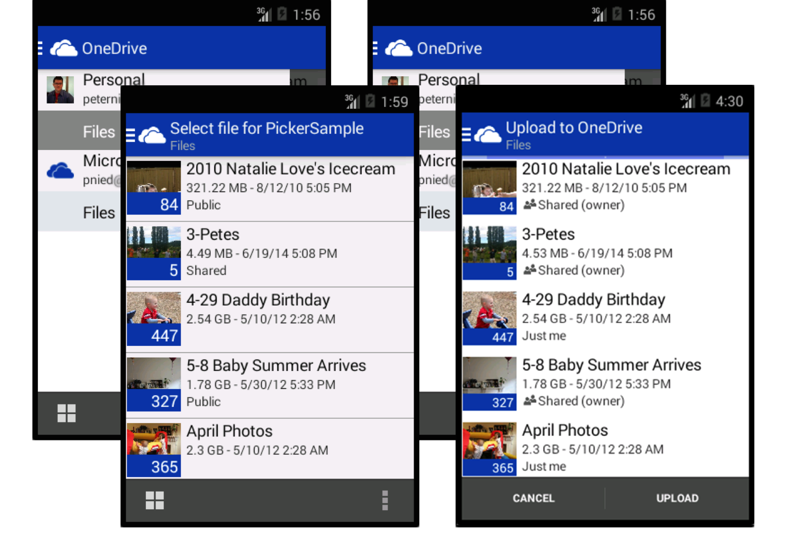

# OneDrive picker for Android
[  ](https://bintray.com/onedrive/Maven/onedrive-picker-android/_latestVersion)
[](https://travis-ci.org/OneDrive/onedrive-picker-android)

The picker is the fastest way to integrate your Android app with OneDrive and OneDrive for Business. It provides a set of Java APIs that your app can use to browse, select, open and save files in your user's OneDrive. When opening files from OneDrive, you can also get shareable links to these files. Links are great for sharing files with friends, coworkers, and relatives. You can also get thumbnails of images and videos, so you don't have to build them yourself.

In this guide, we’ll show you how to quickly get your app to [open](#open-files) and [save files](#save-files) on OneDrive. You can also follow along with our [open picker sample app](PickerSample) and [saver sample app](SaverSample).



[Set up](#setup)

[Open files](#open-files)

[Save files](#save-files)

[Supported Android Versions](#supported-android-versions)


## Set up

## Compile with the source code

The picker for Android is available as open source on GitHub, and includes both open and save capabilities. You can either download the latest version directly or clone the repository:

* [Download zip](https://github.com/OneDrive/onedrive-picker-android/archive/master.zip)
* `git clone https://github.com/OneDrive/onedrive-picker-android.git`

Once you've downloaded the picker for Android, you must configure your environment to work with the sample. For information on configuring your environment to work with sample apps, see [Configuring your Android Environment](http://developer.android.com/sdk/index.html).

## Install AAR via Gradle

Install an Android Archive (AAR) file from Gradle.

```gradle
repositories {
    jcenter()
}

dependencies {
    compile ('com.microsoft.onedrivesdk:onedrive-picker-android:v2.0')
}
```

### Get an App Id

You must register your app with Microsoft to launch the picker. Register your app [here](https://account.live.com/developers/applications) to get an App ID (Client ID).

### Building the library

#### Android Studio
1. Choose **Import Project...** or **Import Module...**, to import into an existing project.
2. Browse to the location where you saved the SDK and select the root *onedrive-picker-android*.
3. If you haven't already installed the *Android SDK Manager*, follow the prompts to install Android 4.4.2 (API 19) and the associated build tools.

#### Eclipse
1. In Eclipse, go to **File** → **Import** → **General** → **Existing Projects into Workspace**.
2. Click **Browse..** and select *onedrive-picker-android*, where you saved the SDK, as your root directory. Make sure to select the *OneDriveSDK* checkbox.
3. If you haven't already installed the *Android SDK Manager*, install Android 4.4.2 (API 19).
4. Right-click your project and choose **Properties**, then go to **Android** in the left side bar.
5. Click **Add..** in *Library* and choose *OneDriveSDK* to link it to your project.

## Open files

Your app needs to give the user a way to open files on OneDrive. This example sets up a click handler that launches the open picker. In the following code snippet, the app requests a view-only sharing link by using `LinkType.WebViewLink`.

**Be sure to replace APP_ID with your app ID**

```java
import android.view.View.OnClickListener;
import com.microsoft.onedrivesdk.picker.*;

// Within the activity's class definition

private IPicker mPicker;
private String ONEDRIVE_APP_ID = "APP_ID"; // Get app id here: https://account.live.com/developers/applications

// The onClickListener that will start the OneDrive picker
private final OnClickListener mStartPickingListener = new OnClickListener() {
    @Override
    public void onClick(final View v) {
        mPicker = Picker.createPicker(ONEDRIVE_APP_ID);
        mPicker.startPicking((Activity)v.getContext(), LinkType.WebViewLink);
    }
};
```

When the `onClick()` method is invoked, the picker is created and configured for the type of link requested by the user. Then the `startPicking()` method launches the user's file picking experience. If the user does not have the OneDrive app installed, they will be prompted to download the app from the app store.

### Link types
The open picker returns a URL for the selected file in one of these formats:
* `LinkType.DownloadLink` - A URL that provides download access to the contents of the file. The URL expires after one hour.
* `LinkType.WebViewLink` - A sharing link that provides a web preview of the file. The link is valid until the user deletes the shared link through OneDrive. Sharing links are not available for files on OneDrive for Business.

### Catching the results
When the user has completed opening a file, or has cancelled the open picker, the `onActivityResult()` method is called to handle the picker results. The following method catches the results and gets access to the file selected by the user.

```java
protected void onActivityResult(final int requestCode, final int resultCode, final Intent data) {
    // Get the results from the picker
    IPickerResult result = mPicker.getPickerResult(requestCode, resultCode, data);
    // Handle the case if nothing was picked
    if (result != null) {
        // Do something with the picked file
        Log.d("main", "Link to file '" + result.getName() + ": " + result.getLink());
        return;
    }

    // Handle non-OneDrive picker request
    super.onActivityResult(requestCode, resultCode, data);
}
```

If the user cancels the file picker, the result object will be null.

### Picker Result Object
In addition to the filename and link for the file, you can access several other properties on the `IPickerResult` object:

```java
public static class IPickerResult {
	// Name of the file with extension
	public String getName();

	// Type of link generated
	public LinkType getLinkType();

	// URI for the file, which varies based on the value of getLinkType()
	public Uri getLink();

	// Size of the file, in bytes
	public int getSize();

	// Set of thumbnail links for various sizes: "small", "medium", and "large"
	public Map<String, Uri> getThumnailLinks();
}
```

Run the [open picker sample app](PickerSample) to see this in action.

## Save files

Your app should provide a way for users to save files on OneDrive. In this code sample, `onClick()` creates a placeholder file named file.txt, located in the app's local folder. The file needs to have a filename and URI on the device to be pass into the saver. It then creates a saver, and `startSaving()` launches the OneDrive saver experience, allowing users to pick a file to upload. If the user does not have the OneDrive app installed, they will be prompted to download the app from the store.

The saver supports the `content://` and `file://` file URI scheme. If a different URI scheme is used, the saver will return a `NoFileSpecified` error. See below for details about the saver response.

**Be sure to replace APP_ID with your app ID**

```java
import android.view.View.OnClickListener;
import com.microsoft.onedrivesdk.saver.*

// Within the activity's class definition

private ISaver mSaver;
private String ONEDRIVE_APP_ID = "APP_ID"; // Get app id here: https://account.live.com/developers/applications

// The onClickListener that will start the OneDrive picker
private final OnClickListener mStartPickingListener = new OnClickListener() {
    @Override
    public void onClick(final View v) {
        // create example file to save to OneDrive
        final String filename = "file.txt";
        final File f = new File(context.getFilesDir(), filename);

        // create and launch the saver
        mSaver = Saver.createSaver(ONEDRIVE_APP_ID);
        mSaver.startSaving((Activity)v.getContext(), filename, Uri.fromFile(f));
    }
};

```

### Saver result

When the user has finished saving a file, or if there was a problem saving, the `onActivityResult()` method is called to handle the saver result. By using this method, you can check if the file was saved, and if not, you can catch the exception and handle the error.

```java
protected void onActivityResult(final int requestCode, final int resultCode, final Intent data) {
    // check that the file was successfully saved to OneDrive
    try {
        mSaver.handleSave(requestCode, resultCode, data);
    } catch (final SaverException e) {
        // Log error information
        Log.e("OneDriveSaver". e.getErrorType().toString()); // Provides one of the SaverError enum
        Log.d("OneDriveSaver", e.getDebugErrorInfo()); // Detailed debug error message
    }
}

```
The error message provided by `getDebugErrorInfo()` is primarily for development and debugging, and may change at any time. When handling errors, you use `getErrorType()` to determine the general cause of the error.


### Saver error types

The following error types are defined by `SaverError`:

```java
public enum SaverError {

    // The error type was not known
    Unknown,

    // The saver was cancelled by the user
    Cancelled,

    // The OneDrive account did not have enough quota available to save the file
    OutOfQuota,

    // The file could not be saved onto OneDrive because it contained
    // unsupported characters
    InvalidFileName,

    // No network connectivity was available when attempting to save the file
    NoNetworkConnectivity,

    // The Uri to the file could not be accessed
    CouldNotAccessFile,

    // No file was specified to be saved, or the file URI scheme was not supported,
    // content:// and file:// are currently supported
    NoFileSpecified

}
```
Run the [saver sample app](SaverSample) to see this in action.

## Supported Android Versions
The OneDrive picker library is supported at runtime for [Android API revision 14](http://source.android.com/source/build-numbers.html) and greater. To build the picker library you need to install Android API revision 19 or greater.

You must install the OneDrive app to to use the picker. If the OneDrive app is not installed, the user will be prompted to download the app during the open or save experience.


## Contributing

This project has adopted the [Microsoft Open Source Code of Conduct](https://opensource.microsoft.com/codeofconduct/). For more information see the [Code of Conduct FAQ](https://opensource.microsoft.com/codeofconduct/faq/) or contact [opencode@microsoft.com](mailto:opencode@microsoft.com) with any additional questions or comments.
