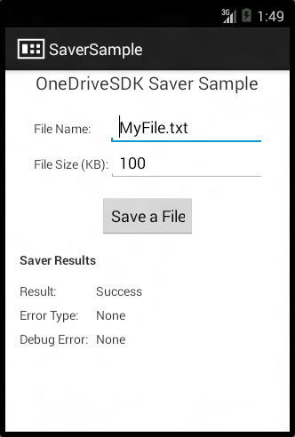

# Android saver sample app

## What it does

The OneDrive saver sample app provides a quick view of the data needed to save a file, the saver experience and the possible results. You can use this sample alongside the [guide](README.md) to learn more about how the saver works, but beyond that it won’t do much for you.

## How to use it

### Get the SDK (contains sample app)
- [Download the zip](https://github.com/OneDrive/onedrive-picker-android/archive/master.zip) and extract the files

OR
- [Clone the repo](https://github.com/OneDrive/onedrive-picker-android.git): `git clone https://github.com/OneDrive/onedrive-picker-android.git`

### Setup

1. In Android Studio, select **Import Project...**.  In Eclipse, go to **File** → **Import** → **General** → **Existing Projects into Workspace**.
2. Click **Browse..** to select the *onedrive-picker-android*, where you saved the SDK, as your root directory. Make sure *OneDriveSDK* and *OneDriveSDK.SaverSample* are checked.
3. If not already installed, follow prompts or go to the *Android SDK Manager* to install Android 4.4.2 (API 19)

### Run the app
1. In Android Studio, **Run 'Saver Sample'**. In Eclipse, right-click the *OneDriveSDK.SaverSample* project and select **Run As** → **Android Application**.

    > *Note the application will not be able to launch the OneDrive saver in the emulator.*

2. Select "Save File" to launch the OneDrive saver with the preset values or choose your own file name and file size. *The saver will provide a login screen, if you are not logged into the OneDrive app.*
3. Choose a location to upload the blank file and see whether it succesfully uploaded (or not) in the sample app!
